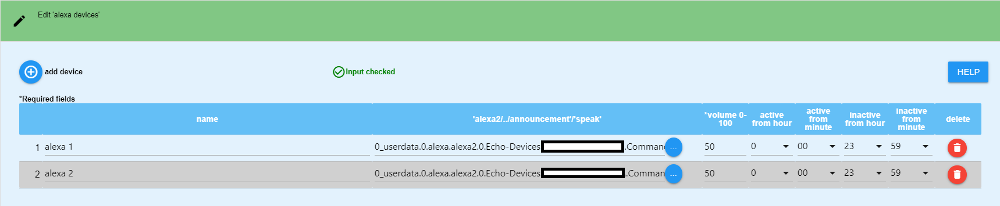
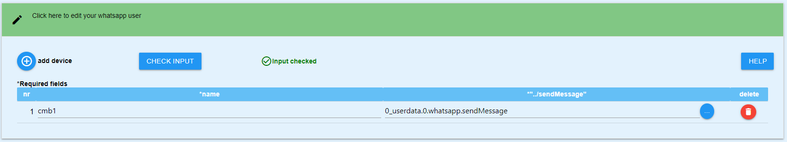

# ioBroker.device-reminder !!!BETA RELEASE!!! 

**ACHTUNG: Es ist zwingend erforderlich alle vorhandenen Instanzen zu löschen, sollte man von einer Version kleiner 0.2 kommen !!!**

# Adapter zur Überwachung von Gerätezuständen
Dieser Adapter kann anhand von Messsteckdosen erkennen, ob ein Gerät eingeschaltet, in Betrieb oder ausgeschaltet wurde und darauf reagieren. Derzeit können Nachrichten per Telegram (Mehrfachauswahl pro Gerät möglich) oder Alexa (Mehrfachauswahl pro Gerät möglich) automatisiert ausgegeben werden. Es ist ebenfalls möglich, die Steckdose nach Beendigung des Vorgangs automatisch abzuschalten. (voheriges Projekt, aus dem dieser Adapter entstanden ist: https://github.com/Xenon-s/js.device-reminder)

# Was sollte beachtet werden?
Der refresh Intervall vom "Live-Verbrauchswert (heißt bei den meisten Geräten **"_energy"**)" sollte nicht mehr als 10 Sekunden betragen, da es sonst zu sehr stark verzögerten Meldungen kommen kann.
 Befehl in der Tasmota Konsole : TelePeriod 10  

# Welche Geräte können zur Zeit überwacht werden?
- Waschmaschine,
- Trockner,
- Geschirrspüler,
- Wasserkocher,
- Computer,
- Mikrowelle
 
- weitere werden folgen ... 

# Was ist pro Gerät möglich?
- Benachrichtigung beim Gerätestart
- Benachrichtigung beim Vorgangsende des jeweiligen Gerätestart 
- Telegram-Benachrichtigung (mehrere IDs sind möglich) 
- Alexa-Benachrichtigung (mehrere IDs sind möglich) 
- WhatsApp-Benachrichtung mehrere IDs sind möglich)
- Datenpunkte mit dem aktuellen Zustand, Live-Verbrauch und letzte gesendete Statusmeldung, um Werte aus diesem Adapter in anderen Scripten verwenden zu können
- Geräte bei Bedarf abschalten (auch zeitverzögert), wenn Vorgang beendet erkannt wurde 

# Anleitung
Zuerst müssen alle gewünschten Devices, Alexas, etc in der Config angelegt werden, bevor sie genutzt werden können. Wenn alle Eingaben komplett abgeschlossen sind, muss zwingend auf **"Speichern und Schliessen"** geklickt werden. Erst danach sind die Geräte wirklich angelegt und können auf der Startseite "devices" weiter konfiguriert werden.

Reiter "config"

## device anlegen
Zuerst muss über das "+ add device" ein neuer Eintrag erzeugt werden. Dadurch wird folgende Tabellenzeile erzeugt:

- **device name**: Frei wählbarer Name, auch Sonderzeichen sind möglich
- **device type**: hier muss ausgewählt werden, um welches Gerät es sich handelt, damit die Berechnungen im Adapter korrekt ausgeführt werden können
- **path consumption**: Per Klick auf die Schaltfläche mit den drei weißen Punkten öffnet sich eure Objektverwaltung. Es muss der Datenpunkt ausgewählt werden, welcher den aktuellen Live-Verbrauch anzeigt.
- **path switch on/off**: Per Klick auf die Schaltfläche mit den drei weißen Punkten öffnet sich eure Objektverwaltung. Es muss der Datenpunkt ausgewählt werden, welcher eure Steckdose an/aus schaltet (keine Pflicht)
- **Starttext**: Benachrichtigung die gesendet werden soll, wenn das Gerät gestartet wird (auch Sonderzeichen sind möglich). 
- **Endtext**: Benachrichtigung die gesendet werden soll, wenn das Gerät seinen Vorgang beendet hat (auch Sonderzeichen sind möglich). 

Bei **Starttext** und **Endtext** kann man sich auch eine Nachricht aus einem externen Datenpunkt holen. Diese Nachricht wird mit 1 Sekunde Verzögerung aus dem Datenpunkt gelesen, nachdem sich der Status des Geräts geändert hat. Somit kann man sich per externem Script eine Nachricht erstellen lassen. Der Adapter erkennt automatisch, ob eine Nachricht aus einem Datenpunkt stammt oder ob diese manuell einfach nur eingegeben wurde. Um einen Datenpunkt auszuwählen, einfach auf die Schaltfläche mit den drei weißen Punkten klicken und dann den entsprechenden Datenpunkt auswählen. **Bitte beachten**: es kann nur entweder ein Datenpunkt **oder** eine händisch eingetragene Nachricht verwendet werden!

## Alexa erstellen
Zuerst muss über das "+ add alexa device" ein neuer Eintrag erzeugt werden. Dadurch wird folgende Tabellenzeile erzeugt:

- **alexa name**: Frei wählbarer Name, auch Sonderzeichen sind möglich
- **alexa"announcement"/"speak"**: Hier muss **zwingend** der Datenpunkt ausgewählt werden, welcher eure Alexa sprechen lässt. Um den Datenpunkt auszuwählen, einfach auf die Schaltfläche mit den drei kleinen weißen Punkten klicken.
Mit den 4 letzten Feldern kann ein Zeitraum erstellt werden, in dem eure Alexa Sprachausgaben tätigen darf. Standardmäßig ist der Zeitraum von 00:00 Uhr - 23:59 Uhr aktiv.
- **"time active hour"**: Startzeit in Stunden
- **"time active min"**: Startzeit in Minuten
- **"time inactive hour"**: Endzeit in Stunden
- **"time inactive min"**: Endzeit in Minuten

## SayIt device erstellen
Zuerst muss über das "+ add sayit device" ein neuer Eintrag erzeugt werden. Dadurch wird folgende Tabellenzeile erzeugt:

Zuerst muss über das "+ ein neuer Eintrag erzeugt werden.
- **sayit name**: Frei wählbarer Name, auch Sonderzeichen sind möglich
- **sayit path"../text"**: den Datenpunkt "text" im jeweiligen sayIt device Ordner auswählen. Hier wird die Textausgabe hingesendet.
- **sayit volume 0-100**: *optional* hier kann man eine Lautstärke vorgeben (default: 50). Werte zwischen 0 und 100 sind möglich.
- **"time active hour"**: Startzeit in Stunden
- **"time active min"**: Startzeit in Minuten
- **"time inactive hour"**: Endzeit in Stunden
- **"time inactive min"**: Endzeit in Minuten

## whatsapp user erstellen
Zuerst muss über das "+ add whatsapp user" ein neuer Eintrag erzeugt werden. Dadurch wird folgende Tabellenzeile erzeugt:

- **whatsapp name**: Frei wählbarer Name, auch Sonderzeichen sind möglich
- **whatsapp path"sendMessage"**: den Datenpunkt "sendMessage" im jeweiligen whatsapp Ordner auswählen. Hier wird die Textausgabe hingesendet.

## Devices konfigurieren
Hier werden nun, nachdem man auf "Speichern und Schliessen" geklickt hatte, alle angelegten devices angezeigt und können weiter konfiguriert werden.

- **active**: Ist standardmäßig aktiviert. Hier kann man ein Device vorrübergehend deaktivieren, so dass es keine Benachrichtigungen mehr sendet
- **device name**: wird automatisch angelegt
- **Alexa devices**: alle zuvor erstellen Alexas werden hier aufgelistet und können per Klick hinzugefügt werden
- **sayit ID**: alle zuvor erstellen sayit devices werden hier aufgelistet und können per Klick hinzugefügt werden
- **whatsapp User**: alle zuvor angelegten whatsapp user werden hier aufgelistet und können per Klick hinzugefügt werden
- **Telegram username**: Hier werden alle verfügbaren Telegram User angezeigt und können per Klick dem Gerät zugeordnet werden. 

    **Sollten keine Namen angezeigt werden:**
    Prüfen, ob der Eintrag unter "telegram.X.communicate.users" (das X steht für die jeweilige Instanz, zb 0) folgende Struktur enthält: "{"ID IN ZAHLEN":{"firstName":"User1"}}", wenn nicht kann diese einfach angepasst werden. Der Adapter sucht sowohl nach **firstName**, als auch nach **userName**.

- **auto off**: Wenn angewählt, schaltet sich die Steckdose nach Beendigung des Vorgangs automatisch ab
- **timer**: Hier kann optional ein timeout in **Minuten** eingegeben werden. Nach Ablauf des timeouts wird die Steckdose, *wenn auto off denn altiviert ist*, abgeschaltet. Die Ende Benachrichtigung des Gerätes bleibt von einem timeout jedoch unberührt!

Nachdem nun auf "Speichern und schliessen" geklickt wurde, wird unter Objekte -> device-reminder nun für jedes neu angelegte Device ein Ordner erstellt, in dem nochmal der aktuelle Zustand und Verbrauch (wird aus dem path consumption geholt) angezeigt wird.

# Unterstützung
**Falls euch meine Arbeit gefällt :**  

 

## Changelog
<!--
	Placeholder for the next version (at the beginning of the line):
	### __WORK IN PROGRESS__
-->

### 0.3.1 (2020-11-07)
* (xenon-s) bugfix

### 0.3.0 (2020-11-07)
* (xenon-s) standby Ermittlung, auch wenn die Steckdose nicht abgeschaltet werden soll
* (xenon-s) Es ist nun möglich, Nachrichten aus einem externen Datenpunkt zu holen und als Start / Endnachricht zu versenden
* (xenon-s) Gerät "Mikrowelle" hinzugefügt

### 0.2.1 (2020-11-05)
* (xenon-s) readme angepasst

### 0.2.0 (2020-11-05)
* (xenon-s) update auf Version 0.2: index_m komplett überarbeitet und whatsapp hinzugefügt

### 0.1.2 (2020-10-23)
* (xenon-s) fix bug in index_m.html: User werden nicht immer richtig angezeigt

### 0.1.1-beta.0 (2020-10-23)
* (xenon-s) fix package.json

### 0.1.0 (2020-10-23)
* (xenon-s) beta release

### 0.0.1 (2020-10-20)
* (xenon-s) initial commit

## License

MIT License

Copyright (c) 2020 xenon-s

Permission is hereby granted, free of charge, to any person obtaining a copy
of this software and associated documentation files (the "Software"), to deal
in the Software without restriction, including without limitation the rights
to use, copy, modify, merge, publish, distribute, sublicense, and/or sell
copies of the Software, and to permit persons to whom the Software is
furnished to do so, subject to the following conditions:

The above copyright notice and this permission notice shall be included in all
copies or substantial portions of the Software.

THE SOFTWARE IS PROVIDED "AS IS", WITHOUT WARRANTY OF ANY KIND, EXPRESS OR
IMPLIED, INCLUDING BUT NOT LIMITED TO THE WARRANTIES OF MERCHANTABILITY,
FITNESS FOR A PARTICULAR PURPOSE AND NONINFRINGEMENT. IN NO EVENT SHALL THE
AUTHORS OR COPYRIGHT HOLDERS BE LIABLE FOR ANY CLAIM, DAMAGES OR OTHER
LIABILITY, WHETHER IN AN ACTION OF CONTRACT, TORT OR OTHERWISE, ARISING FROM,
OUT OF OR IN CONNECTION WITH THE SOFTWARE OR THE USE OR OTHER DEALINGS IN THE
SOFTWARE.