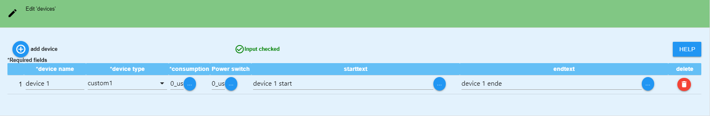
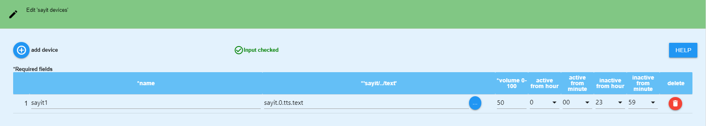
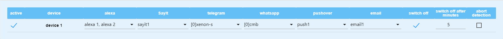
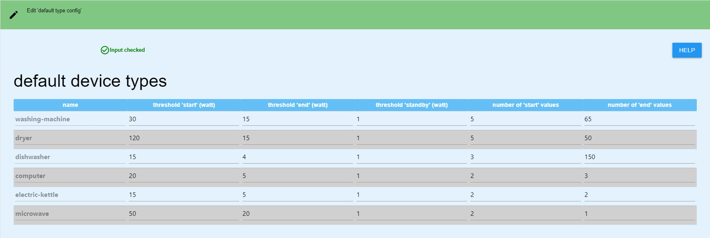
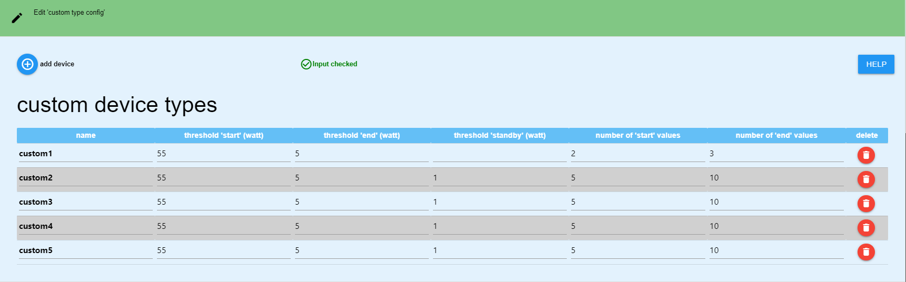

# ioBroker.device-reminder

## English readme needed?  [english readme](https://github.com/Xenon-s/ioBroker.device-reminder/blob/master/README.md)
 

**ACHTUNG**: Es ist zwingend erforderlich alle vorhandenen Instanzen zu löschen, sollte man von einer Version kleiner 0.4 kommen !!!

# Adapter zur Überwachung von Gerätezuständen
Dieser Adapter kann anhand von Messsteckdosen erkennen, ob ein Gerät eingeschaltet, in Betrieb oder ausgeschaltet wurde und darauf reagieren. Es können dann Nachrichten per Telegram, whatsapp, alexa und sayit (Mehrfachauswahl pro Gerät möglich) automatisiert ausgegeben werden. Es ist ebenfalls möglich, die Steckdose nach Beendigung des Vorgangs automatisch abzuschalten (auch Zeitverzögert). (voheriges Projekt, aus dem dieser Adapter entstanden ist: https://github.com/Xenon-s/js.device-reminder)

# Was sollte beachtet werden?
Der refresh Intervall vom "Live-Verbrauchswert (heißt bei den meisten Geräten **"_energy"**)" sollte nicht mehr als 10 Sekunden betragen, da es sonst zu sehr stark verzögerten Meldungen kommen kann.
 Befehl in der Tasmota Konsole : TelePeriod 10  

# Welche Geräte können zur Zeit überwacht werden?
Es gibt default-Werte für folgende Geräte:
- Waschmaschine,
- Trockner,
- Geschirrspüler,
- Wasserkocher,
- Computer,
- Mikrowelle
 
Außerdem stehen 5 Custom devices zur Verfügung. Diese können selber konfiguriert werden, falls Bedarf besteht. Auch können die Schwellwerte aller Gerätetypen manuell angepasst werden.
 

# Was ist pro Gerät möglich?
- Benachrichtigung beim Gerätestart
- Benachrichtigung beim Vorgangsende des jeweiligen Gerätestart 
- Telegram-Benachrichtigung (mehrere IDs sind möglich) 
- Alexa-Benachrichtigung (mehrere IDs sind möglich) 
- WhatsApp-Benachrichtung mehrere IDs sind möglich)
- Benachrichtigungen können frei erstellt oder auch von einem externen Script vorgegeben werden
- Datenpunkte mit dem aktuellen Zustand, Live-Verbrauch und letzte gesendete Statusmeldung, um Werte aus diesem Adapter in anderen Scripten verwenden zu können
- Geräte bei Bedarf abschalten (auch zeitverzögert), wenn Vorgang beendet erkannt wurde
 
 

# Anleitung

Zuerst müssen alle gewünschten Devices, Alexas, etc in der Config angelegt werden, bevor sie genutzt werden können. Wenn alle Eingaben komplett abgeschlossen sind, muss zwingend auf **"click here to reload"** geklickt werden. Erst danach sind die Geräte wirklich angelegt und können im Tab "**DEVICES**" weiter konfiguriert werden.

## device anlegen
Zuerst muss über das **"+ add device"** ein neuer Eintrag erzeugt werden. Dadurch wird folgende Tabellenzeile erzeugt:

- **device name**: Frei wählbarer Name
- **device type**: hier muss ausgewählt werden, um welches Gerät es sich handelt, damit die Berechnungen im Adapter korrekt ausgeführt werden können
- **path consumption/energy**: Per Klick auf die Schaltfläche mit den drei weißen Punkten öffnet sich eure Objektverwaltung. Es muss der Datenpunkt ausgewählt werden, welcher den **aktuellen Live-Verbrauch** anzeigt. 
- **path switch on/off**: Per Klick auf die Schaltfläche mit den drei weißen Punkten öffnet sich eure Objektverwaltung. Es muss der Datenpunkt ausgewählt werden, welcher eure **Steckdose an/aus schaltet** (keine Pflicht)
- **Starttext**: Benachrichtigung die gesendet werden soll, wenn das Gerät gestartet wird (auch Sonderzeichen sind möglich). Es darf sich kein "." am Ende befinden!
- **Endtext**: Benachrichtigung die gesendet werden soll, wenn das Gerät seinen Vorgang beendet hat (auch Sonderzeichen sind möglich). Es darf sich kein "." am Ende befinden!

Bei **Starttext** und **Endtext** kann man sich auch eine Nachricht aus einem externen Datenpunkt holen. Diese Nachricht wird mit 1 Sekunde Verzögerung aus dem Datenpunkt gelesen, nachdem sich der Status des Geräts geändert hat. Somit kann man sich per externem Script eine Nachricht erstellen lassen. Der Adapter erkennt automatisch, ob eine Nachricht aus einem Datenpunkt stammt oder ob diese manuell einfach nur eingegeben wurde. Um einen Datenpunkt auszuwählen, einfach auf die Schaltfläche mit den drei weißen Punkten klicken und dann den entsprechenden Datenpunkt auswählen. **Bitte beachten**: es kann nur entweder ein Datenpunkt **oder** eine händisch eingetragene Nachricht verwendet werden!
 
 

## Alexa erstellen

Zuerst muss über das **"+ add alexa device"** ein neuer Eintrag erzeugt werden. Dadurch wird folgende Tabellenzeile erzeugt:

- **alexa name**: Frei wählbarer Name, auch Sonderzeichen sind möglich
- **alexa"announcement"/"speak"**: Hier muss **zwingend** der Datenpunkt ausgewählt werden, welcher eure Alexa sprechen lässt. Um den Datenpunkt auszuwählen, einfach auf die Schaltfläche mit den drei kleinen weißen Punkten klicken.
- **volume 0-100**: *optional* hier kann man eine Lautstärke vorgeben (default: 50). Werte zwischen 0 und 100 sind möglich.
Mit den 4 letzten Feldern kann ein Zeitraum erstellt werden, in dem eure Alexa Sprachausgaben tätigen darf. Standardmäßig ist der Zeitraum von 00:00 Uhr - 23:59 Uhr aktiv.
- **"time active hour"**: Startzeit in Stunden
- **"time active min"**: Startzeit in Minuten
- **"time inactive hour"**: Endzeit in Stunden
- **"time inactive min"**: Endzeit in Minuten
 
 

## SayIt device erstellen

Zuerst muss über das **"+ add sayit device"** ein neuer Eintrag erzeugt werden. Dadurch wird folgende Tabellenzeile erzeugt:

- **sayit name**: Frei wählbarer Name, auch Sonderzeichen sind möglich
- **sayit path"../text"**: den Datenpunkt "text" im jeweiligen sayIt device Ordner auswählen. Hier wird die Textausgabe hingesendet.
- **volume 0-100**: *optional* hier kann man eine Lautstärke vorgeben (default: 50). Werte zwischen 0 und 100 sind möglich.
- **"time active hour"**: Startzeit in Stunden
- **"time active min"**: Startzeit in Minuten
- **"time inactive hour"**: Endzeit in Stunden
- **"time inactive min"**: Endzeit in Minuten
 
 

## whatsapp user erstellen

Zuerst muss über das **"+ add whatsapp user"** ein neuer Eintrag erzeugt werden. Dadurch wird folgende Tabellenzeile erzeugt:

- **whatsapp name**: Frei wählbarer Name, auch Sonderzeichen sind möglich
- **whatsapp path"sendMessage"**: den Datenpunkt "sendMessage" im jeweiligen whatsapp Ordner auswählen. Hier wird die Textausgabe hingesendet.

## config speichern
Wenn alle Geräte und Messenger eingefügt wurden, muss über den Save Button **click here to reload** auf der Seite gespeichert werden! Dadurch wird die Tabelle im Tab "**devices**" aktualisiert. Da es Probleme mit der Darstellung gab, wird die Tabelle mit einer kleinen Verzögerung generiert.  
*Hinweis:* Wenn man an einem bereits vorhandenen device z.B. den Namen ändert und danach auf den **click here to reload** Button klickt, wird das device in der Tabelle neu erstellt und muss dementsprechend auch noch konfiguriert werden (alexa zuordnen, etc).
 
 

  
Der Button wird nur aktiv, wenn neue Geräte eingefügt oder bestehende geändert werden!
 
 

# Devices konfigurieren

## configure your own device status

- **in action**: Status der angezeigt wird, wenn das Gerät in Betrieb ist.
- **in standby**: Status der angezeigt wird, wenn sich das Gerät in standby befindet.
- **device off**: Status der angezeigt wird, wenn das Gerät ausgeschaltet ist.

## device konfigurieren

Hier werden nun, nachdem man auf den Button "**click here to reload**" auf der Config Seite geklickt hatte, alle angelegten devices angezeigt und können weiter konfiguriert werden.

- **active**: Ist standardmäßig aktiviert. Hier kann man ein Device vorrübergehend deaktivieren, so dass es keine Benachrichtigungen mehr sendet
- **device name**: wird automatisch angelegt
- **Alexa devices**: alle zuvor erstellen Alexas werden hier aufgelistet und können per Klick hinzugefügt werden
- **sayit ID**: alle zuvor erstellen sayit devices werden hier aufgelistet und können per Klick hinzugefügt werden
- **whatsapp User**: alle zuvor angelegten whatsapp user werden hier aufgelistet und können per Klick hinzugefügt werden
- **Telegram username**: Hier werden alle verfügbaren Telegram User angezeigt und können per Klick dem Gerät zugeordnet werden. 

    **Sollten keine Namen angezeigt werden:**
    Prüfen, ob der Eintrag unter "telegram.X.communicate.users" (das X steht für die jeweilige Instanz, zb 0) folgende Struktur enthält: "{"ID IN ZAHLEN":{"firstName":"User1"}}", wenn nicht kann diese einfach angepasst werden. Der Adapter sucht sowohl nach **firstName**, als auch nach **userName**. Man kann sich dann entscheiden, an welchen Namen gesendet werden soll. Es kann nur entweder der **firstName** oder der **userName** gewählt werden!

- **auto off**: Wenn angewählt, schaltet sich die Steckdose nach Beendigung des Vorgangs automatisch ab
- **timer**: Hier kann optional ein timeout in **Minuten** eingegeben werden. Nach Ablauf des timeouts wird die Steckdose, *wenn auto off denn altiviert ist*, abgeschaltet. Die Ende Benachrichtigung des Gerätes bleibt von einem timeout jedoch unberührt!

Nachdem nun auf "**Speichern und schliessen**" geklickt wurde, wird unter *Objekte -> device-reminder* nun für jedes neu angelegte Device ein Ordner erstellt, in dem 
- die aktuelle Laufzeit in hh:mm:ss  
- die aktuelle Laufzeit in Millisekunden
- der aktuelle Zustand des devices
- der aktuelle Live-Verbrauch (wird aus dem *path consumption/energy* geholt) und
- die Nachricht an die Messenger
- averageConsumption (Kann als Hilfe genutzt werden um die eigenen Schwellwerte zu ermitteln)
- do not disturb (wenn aktiviert, werden keine Nachrichten versendet)
angezeigt wird.
 
 

# device type konfigurieren

**Achtung**: Änderungen der Werte können dazu führen, dass Geräte nicht mehr Ordnungsgemäß erfasst werden und es so zu Falschmeldungen kommt. 

In der ersten Tabelle werden die "default" Werte angezeigt. Diese Werte wurden über einen Zeitraum von mehreren Monaten ermittelt und sollten nicht angepasst werden. Ich erkläre die Bedeutung der einzelnen Werte trotzdem.
- **starting value**: Startwert in Watt der überschritten werden muss, damit das Gerät als gestartet erkannt werden kann
- **final value**: Endwert in Watt der unterschritten werden muss, damit das Gerät als beendet erkannt werden kann
- **Number of values​​ "start"**: Hier wird angegeben, wie oft der "Startwert" **in Folge** überschritten werden muss. Ein einmaliges Unterschreiten führt zum Startabbruch. Der Durchschnitt dieser Werte muss über dem Startwert liegen, damit das Gerät als gestartet erkannt wird.
*Bsp: Der Wert soll 10W betragen und 3x in Folge überschritten werden. 1. 15W, 2. 1W, 15W => Startphase wurde abgebrochen, weil der zweite Wert unter 10 lag.*
- **Number of values ​"end"**: Hier wird angegeben, wie viele Werte aufgezeichnet werden sollen, bevor berechnet wird, ob das Gerät fertig ist. Je weniger Werte hier stehen, desto ungenauer ist das Ergebnis und die Gefahr von Falschmeldungen steigt. Je höher der Wert, umso genauer die Erfassung. Nachteil ist jedoch, dass die Fertigmeldung stark verzögert gesendet wird. Ende wird erst dann erkannt, wenn "number of values end" erreicht ist und der Durchschnittsverbrauch unter dem "final value" liegt.
 
 

*Kurze Beispielrechnung:*
Es kommen alle 10 Sekunden Verbrauchswerte rein. **final value** steht auf 50, **values end** auf 100. Nachdem das Gerät als gestartet erkannt wurde, werden 100 Werte (*dauert 100Werte x 10 Sekunden = 1000 Sekunden*) aufgezeichnet und erst danach der Mittelwert gebildet. Liegt dieser unter 50, wird nach ca 16,5 Minuten (wir erinnern uns an **values end** = 100 Werte) **fertig** erkannt und es geht eine Meldung (wenn denn konfiguriert) raus. Liegt der Wert über 50, passiert nichts, da das Gerät noch in Betrieb ist. Jeder weitere Wert ersetzt nun den ältesten und es wird nach jedem neuen Wert ein neuer Durchschnitt berechnet.
 
 

Wenn ihr bis hierher gelesen habt und immer noch der Meinung seid, dass ihr angepasste Werte benötigt, stehen euch noch **5 Custom Types** zur freien Gestaltung zur Verfügung.

Zur Funktion einfach bei "**default devices**" hier drüber lesen.

# Unterstützung
**Falls euch meine Arbeit gefällt :**  

 

## Changelog

Der Changelog ist in der englischen Version der readme zu finden  
[english readme](https://github.com/Xenon-s/ioBroker.device-reminder/blob/master/README.md)
 
 

# License

MIT License

Copyright (c) 2020 xenon-s

Permission is hereby granted, free of charge, to any person obtaining a copy
of this software and associated documentation files (the "Software"), to deal
in the Software without restriction, including without limitation the rights
to use, copy, modify, merge, publish, distribute, sublicense, and/or sell
copies of the Software, and to permit persons to whom the Software is
furnished to do so, subject to the following conditions:

The above copyright notice and this permission notice shall be included in all
copies or substantial portions of the Software.

THE SOFTWARE IS PROVIDED "AS IS", WITHOUT WARRANTY OF ANY KIND, EXPRESS OR
IMPLIED, INCLUDING BUT NOT LIMITED TO THE WARRANTIES OF MERCHANTABILITY,
FITNESS FOR A PARTICULAR PURPOSE AND NONINFRINGEMENT. IN NO EVENT SHALL THE
AUTHORS OR COPYRIGHT HOLDERS BE LIABLE FOR ANY CLAIM, DAMAGES OR OTHER
LIABILITY, WHETHER IN AN ACTION OF CONTRACT, TORT OR OTHERWISE, ARISING FROM,
OUT OF OR IN CONNECTION WITH THE SOFTWARE OR THE USE OR OTHER DEALINGS IN THE
SOFTWARE.
