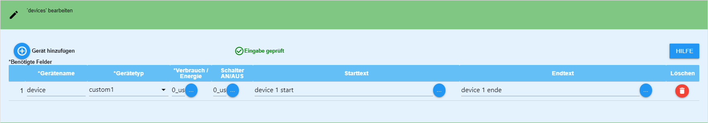
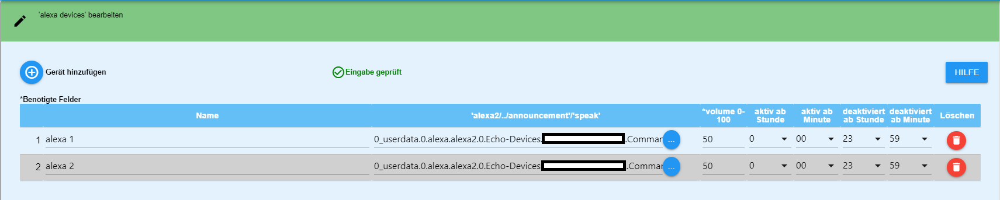
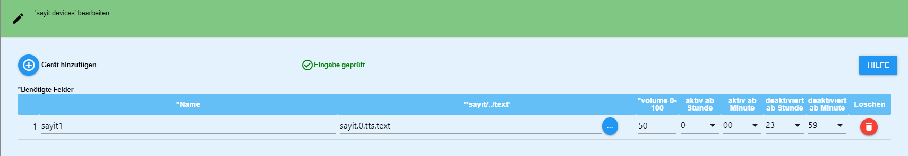
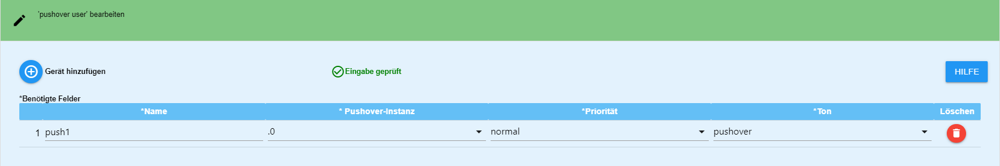
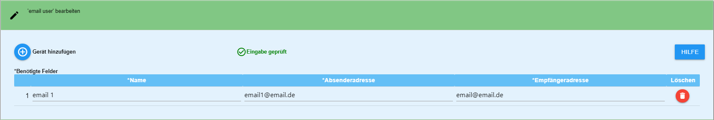
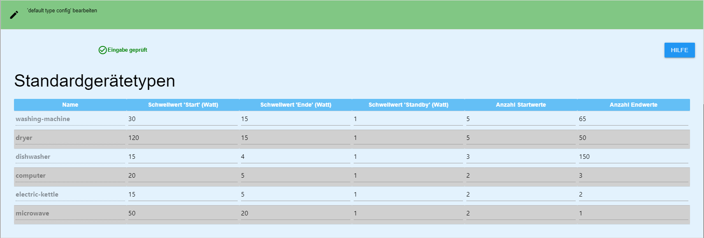
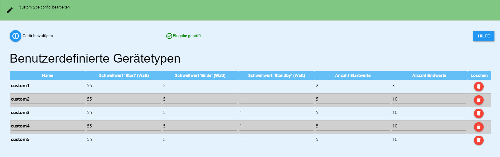
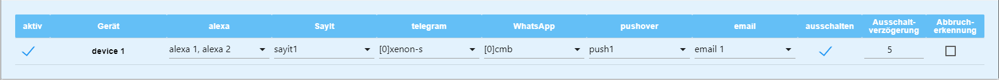

# ioBroker.device-reminder

## English readme needed?  [english readme](https://github.com/Xenon-s/ioBroker.device-reminder/blob/master/README.md)
 

# Adapter zur Überwachung von Gerätezuständen Version > 1.1
Dieser Adapter kann anhand von Messsteckdosen erkennen, ob ein Gerät eingeschaltet, in Betrieb ist oder ausgeschaltet wurde und darauf reagieren. Es können dann Nachrichten per Telegram, whatsapp, alexa, sayit, pushover und Email (Mehrfachauswahl pro Gerät möglich) automatisiert ausgegeben werden. Es ist ebenfalls möglich, die Steckdose nach Beendigung des Vorgangs automatisch abzuschalten (auch Zeitverzögert). Bei vorgegebener Laufzeit ist es möglich, sich per Datenpunkt einen Alarm auszugeben (mit externem Script, der Datenpunkt liefert nur true/false oder als Anzeige in der vis). Hierfür genügt es, die Vorgabelaufzeit einfach in Minuten in den Datenpunkt 'device-reminder.X.XXX.config.runtime max' einzutragen.

# Was sollte beachtet werden?
Der refresh Intervall vom "Live-Verbrauchswert (heißt bei den meisten Geräten **"_energy"**)" sollte nicht mehr als 10 Sekunden betragen, da es sonst zu sehr stark verzögerten Meldungen kommen kann. Der Adapter selber pollt alle 10 Sekunden die Werte und nutzt neue Werte Event-basiert. Das schont das System
 
Befehl in der Tasmota Konsole : TelePeriod 10

# Was ist pro Gerät möglich?
- Benachrichtigung beim Gerätestart
- Benachrichtigung beim Vorgangsende des jeweiligen Gerätes 
- Telegram-Benachrichtigung (mehrere IDs sind möglich) 
- Alexa-Benachrichtigung (mehrere IDs sind möglich) 
- WhatsApp-Benachrichtung (mehrere IDs sind möglich)
- Pushover-Benachrichtung (mehrere IDs sind möglich)
- Email-Benachrichtung (mehrere IDs sind möglich)
- Benachrichtigungen können frei erstellt oder auch von einem externen Script vorgegeben werden
- Datenpunkte mit dem aktuellen Zustand, Live-Verbrauch und letzte gesendete Statusmeldung, um Werte aus diesem Adapter in anderen Scripten verwenden zu können
- Geräte bei Bedarf abschalten (auch zeitverzögert), wenn Vorgang beendet erkannt wurde
- Sprachassistenten können per Datenpunkt vorrübergehend deaktiviert werden
- Laufzeitüberwachung in Minuten: Wird die Zeit überschritten, wird ein Alarm an alle ausgewählten Messenger gesendet

# Anleitung

## Grundlegendes vorab

Es gibt für jede Gruppe an devices, alexa etc. den Button "Eingabe Prüfen". Wird dieser Button angeklickt werden die vorhanden Eingaben auf Plausibilität geprüft und man bekommt sofort eine Antwort, ob alle Eingaben richtig sind. Hat man Änderungen vorgenommen, so muss dieser Button immer angeklickt werden!

## device anlegen

- **Gerätename**: Frei wählbarer Name
- **Gerätetyp**: hier muss ausgewählt werden, um welches Gerät es sich handelt, damit die Berechnungen im Adapter korrekt ausgeführt werden können
- **Verbrauch**: Per Klick auf die Schaltfläche mit den drei weißen Punkten öffnet sich eure Objektverwaltung. Es muss der Datenpunkt ausgewählt werden, welcher den **aktuellen Live-Verbrauch** anzeigt. 
- **Gesamter Verbrauch**: Per Klick auf die Schaltfläche mit den drei weißen Punkten öffnet sich eure Objektverwaltung. Es muss der Datenpunkt ausgewählt werden, welcher den **gesamten Verbrauch** anzeigt. (keine Pflicht)
- **Schalter AN/AUS**: Per Klick auf die Schaltfläche mit den drei weißen Punkten öffnet sich eure Objektverwaltung. Es muss der Datenpunkt ausgewählt werden, welcher eure **Steckdose an/aus schaltet** (keine Pflicht)
- **Starttext**: Benachrichtigung die gesendet werden soll, wenn das Gerät gestartet wird (auch Sonderzeichen sind möglich)
- **Endtext**: Benachrichtigung die gesendet werden soll, wenn das Gerät seinen Vorgang beendet hat (auch Sonderzeichen sind möglich)

Bei **Starttext** und **Endtext** kann man sich auch eine Nachricht aus einem externen Datenpunkt holen. Diese Nachricht wird mit 1 Sekunde Verzögerung aus dem Datenpunkt gelesen, nachdem sich der Status des Geräts geändert hat. Somit kann man sich per externem Script eine Nachricht erstellen lassen. Der Adapter erkennt automatisch, ob eine Nachricht aus einem Datenpunkt stammt oder ob diese manuell einfach nur eingegeben wurde. Um einen Datenpunkt auszuwählen, einfach auf die Schaltfläche mit den drei weißen Punkten klicken und dann den entsprechenden Datenpunkt auswählen. **Bitte beachten**: es kann nur entweder ein Datenpunkt **oder** eine händisch eingetragene Nachricht verwendet werden!

## Platzhalter im Endtext

- Gesamter Verbrauch: Wenn der Datenpunkt Wh ausgibt, so benutze den Platzhalter **{consumption in Wh}**, anonsten **{consumption}**. Es erfolgt immer eine Umrechnung in kWh

Ein Beispiel für den Endtext: 'Die Waschmaschine ist fertig. Verbrauch: {consumption in Wh} kWh'

- Ausgabe der Laufzeit: **{runtime}**

Ein Beispiel für den Endtext: 'Die Waschmaschine ist fertig. Laufzeit: {runtime}'

## Alexa erstellen

- **Name**: Frei wählbarer Name, auch Sonderzeichen sind möglich
- **'alexa2/../announcement'/'speak'**: Hier muss **zwingend** der Datenpunkt ausgewählt werden, welcher eure Alexa sprechen lässt. Um den Datenpunkt auszuwählen, einfach auf die Schaltfläche mit den drei kleinen weißen Punkten klicken.
- **volume 0-100**: Lautstärke, mit der eure Alexa sprechen soll (von 0 - 100%)
Mit den 4 letzten Feldern kann ein Zeitraum erstellt werden, in dem eure Alexa Sprachausgaben tätigen darf. Standardmäßig ist der Zeitraum von 00:00 Uhr - 23:59 Uhr aktiv.
- **aktiv ab Stunde**: Startzeit in Stunden
- **aktiv ab Minute**: Startzeit in Minuten
- **deaktiviert ab Stunde**: Endzeit in Stunden
- **deaktiviert ab Minute**: Endzeit in Minuten

## SayIt device erstellen

- **Name**: Frei wählbarer Name, auch Sonderzeichen sind möglich
- **'sayit/../text'**: den Datenpunkt "text" im jeweiligen sayIt device Ordner auswählen. Hier wird die Textausgabe hingesendet.
- **volume 0-100**: Lautstärke, mit der euer sayit device sprechen soll (von 0 - 100%)
- **aktiv ab Stunde**: Startzeit in Stunden
- **aktiv ab Minute**: Startzeit in Minuten
- **deaktiviert ab Stunde**: Endzeit in Stunden
- **deaktiviert ab Minute**: Endzeit in Minuten

## pushover user erstellen

- **Name**: Frei wählbarer Name, auch Sonderzeichen sind möglich
- **Pushover-Instanz**: die Instanz, an die gesendet werden soll
- **Priorität**: Die Priorität, mit der gesendet werden soll
- **Ton**: Der Sound, der abgespielt werden soll, wenn Pushover die Nachricht erhält

## email user erstellen

- **Name**: Frei wählbarer Name, auch Sonderzeichen sind möglich
- **Absenderadresse**: Emailadresse, von der aus gesendet wird
- **Empfängeradresse**: Emailadresse, die die Nachricht empfangen soll

# default devices

Diese Werte wurden über einen Zeitraum von mehreren Monaten und mit Hilfe von zahlreichen Testern ermittelt. Änderungen der Werte können dazu führen, dass Geräte nicht mehr Ordnungsgemäß erfasst werden und es so zu Falschmeldungen kommt. 

# custom-devices

Diese Werte können von Benutzer angepasst und dann genutzt werden. Im Folgenden die Erklärung dazu:

**WICHTIG**: Diese Schwellwerte beziehen sich immer auf den aktuellen Wert des *average consumption*, der im entsprechenden Datenpunkt des Gerätes im device-reminder Ordner abgelesen werden kann! Dieser Wert wird berechnet und zeigt daher nie den aktuellen Live-Wert an!

- **Schwellwert 'Start' (Watt)**: Startwert in Watt der überschritten werden muss, damit das Gerät als gestartet erkannt wird
- **Schwellwert 'Ende' (Watt)**: Endwert in Watt der unterschritten werden muss, damit das Gerät als beendet erkannt wird
- **Schwellwert 'Standby' (Watt)**: Schwellwert, um Gerät als "AUS" oder "IN STANDBY" anzuzeigen. Liegt der aktuell berechnete Wert unter dem Schwellwert **Standy** so wird das Gerät als ausgeschaltet erkannt
- **Anzahl Startwerte**: Hier wird angegeben, wie oft der "Startwert" **in Folge** überschritten werden muss. Ein einmaliges Unterschreiten führt zum Startabbruch. Der Durchschnitt dieser Werte muss über dem Startwert liegen, damit das Gerät als gestartet erkannt wird.  
*Bsp: Der Wert soll 10W betragen und 3x in Folge überschritten werden. 1. 15W, 2. 1W, 15W => Startphase wurde abgebrochen, weil der zweite Wert unter 10 lag.*
- **Anzahl Endwerte**: Hier wird angegeben, wie viele Werte aufgezeichnet werden sollen, bevor berechnet wird, ob das Gerät fertig ist. Je weniger Werte hier stehen, desto ungenauer ist das Ergebnis und die Gefahr von Falschmeldungen steigt. Je höher der Wert, umso genauer die Erfassung. Nachteil ist jedoch, dass die Fertigmeldung stark verzögert gesendet wird. Ende wird erst dann erkannt, wenn "Anzahl Endwerte" erreicht ist und der Durchschnittsverbrauch unter dem "Schwellwert 'Ende' (Watt)" liegt.

*Kurze Beispielrechnung:*
Es kommen alle 10 Sekunden Verbrauchswerte rein. **Schwellwert 'Ende' (Watt)** steht auf 50, **Anzahl Endwerte** auf 100. Nachdem das Gerät als gestartet erkannt wurde, werden 100 Werte (*dauert 100Werte x 10 Sekunden = 1000 Sekunden*) aufgezeichnet und erst danach der Mittelwert gebildet. Liegt dieser unter 50, wird nach ca 16,5 Minuten (wir erinnern uns an **Anzahl Endwerte** = 100 Werte) **fertig** erkannt und es geht eine Meldung (wenn denn konfiguriert) raus. Liegt der Wert über 50, passiert nichts, da das Gerät noch in Betrieb ist. Jeder weitere Wert ersetzt nun den ältesten und es wird nach jedem neuen Wert ein neuer Durchschnitt berechnet.
 

# Devices konfigurieren

- **aktiv**: Ist standardmäßig aktiviert. Hier kann man ein Device vorrübergehend deaktivieren, so dass es keine Benachrichtigungen mehr sendet
- **Gerät**: wird automatisch angelegt
- **Alexa**: alle zuvor erstellen Alexas werden hier aufgelistet und können per Klick hinzugefügt werden
- **sayit**: alle zuvor erstellen sayit devices werden hier aufgelistet und können per Klick hinzugefügt werden
- **whatsapp**: alle automatisch erkannten whatsapp-user werden hier aufgelistet
- **Pushover**: alle zuvor angelegten Pushover user werden hier aufgelistet und können per Klick hinzugefügt werden
- **email**: alle zuvor angelegten email user werden hier aufgelistet und können per Klick hinzugefügt werden
- **Telegram**: Hier werden alle verfügbaren Telegram User angezeigt und können per Klick dem Gerät zugeordnet werden. In der [eckigen] Klammer wird die jeweilige Instanz angegeben.

    **Sollten keine Namen angezeigt werden:**
    Prüfen, ob der Eintrag unter "telegram.X.communicate.users" (das X steht für die jeweilige Instanz, zb 0) folgende Struktur enthält: "{"ID IN ZAHLEN":{"firstName":"User1"}}", wenn nicht kann diese einfach angepasst werden. Der Adapter sucht sowohl nach **firstName**, als auch nach **userName**. Man kann sich dann entscheiden, an welchen Namen gesendet werden soll. Es kann nur entweder der **firstName** oder der **userName** gewählt werden!

- **ausschalten**: Wenn angewählt, schaltet sich die Steckdose nach Beendigung des Vorgangs automatisch ab
- **Ausschaltverzögerung**: Hier kann optional ein timeout in **Minuten** eingegeben werden. Nach Ablauf des timeouts wird die Steckdose, *wenn auto off denn altiviert ist*, abgeschaltet. Die Ende Benachrichtigung des Gerätes bleibt von einem timeout jedoch unberührt!
- **Abbrucherkennung**: Wenn aktiviert, versucht der Adapter zu erkennen, ob ein Gerät bereits vor der Benachrichtigung von Hand abgeschaltet wurde und meldet dann nicht mehr.

Nachdem nun auf "**Speichern und schliessen**" geklickt wurde, wird unter *Objekte -> device-reminder* nun für jedes neu angelegte Device ein Ordner erstellt, in dem 
- do not disturb (wenn aktiviert, werden keine Nachrichten per **Sprachassistent** versendet)
- runtime max
- der aktuelle Zustand des Gerätes 
- Laufzeitalarm 
- averageConsumption (Kann als Hilfe genutzt werden um die eigenen Schwellwerte zu ermitteln)
- die letzten Durchgänge im JSON-Format
- die letzte Laufzeit in hh:mm:ss
- der aktuelle Live-Verbrauch
- die Nachricht an die Messenger
- die aktuelle Laufzeit in hh:mm:ss 
- die aktuelle Laufzeit in Millisekunden

angezeigt wird.
 

# Unterstützung
**Falls euch meine Arbeit gefällt :**  

 

## Changelog

Der Changelog ist in der englischen Version der readme zu finden  
[english readme](https://github.com/Xenon-s/ioBroker.device-reminder/blob/master/README.md)
 

# License

MIT License

Copyright (c) 2021 xenon-s

Permission is hereby granted, free of charge, to any person obtaining a copy
of this software and associated documentation files (the "Software"), to deal
in the Software without restriction, including without limitation the rights
to use, copy, modify, merge, publish, distribute, sublicense, and/or sell
copies of the Software, and to permit persons to whom the Software is
furnished to do so, subject to the following conditions:

The above copyright notice and this permission notice shall be included in all
copies or substantial portions of the Software.

THE SOFTWARE IS PROVIDED "AS IS", WITHOUT WARRANTY OF ANY KIND, EXPRESS OR
IMPLIED, INCLUDING BUT NOT LIMITED TO THE WARRANTIES OF MERCHANTABILITY,
FITNESS FOR A PARTICULAR PURPOSE AND NONINFRINGEMENT. IN NO EVENT SHALL THE
AUTHORS OR COPYRIGHT HOLDERS BE LIABLE FOR ANY CLAIM, DAMAGES OR OTHER
LIABILITY, WHETHER IN AN ACTION OF CONTRACT, TORT OR OTHERWISE, ARISING FROM,
OUT OF OR IN CONNECTION WITH THE SOFTWARE OR THE USE OR OTHER DEALINGS IN THE
SOFTWARE.